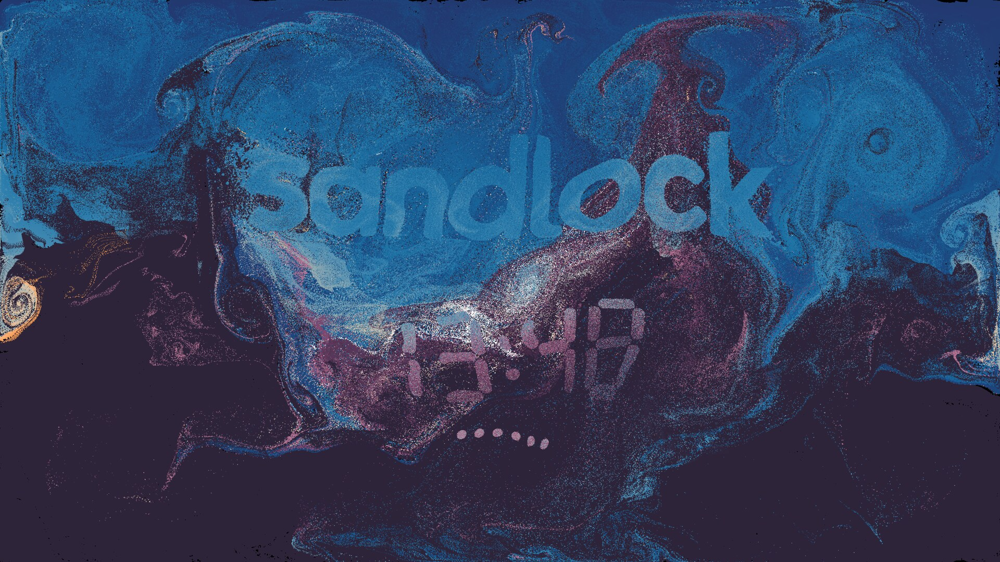

<p align="center">
  
</p>

A Wayland screen locker. When you lock, your desktop dissolves into a storm
of its own pixels, carried by a fluid simulation on the GPU. While the screen
is locked, images, a clock or a Game of Life form out of that sand. When the
right password goes in, every grain flies back home and the lock fades into
the live desktop.



## Features

- **Your desktop, as sand.** sandlock captures every output just before
  locking, and each pixel becomes a grain. A fluid simulation with wind,
  gusts and curls carries the grains. Quiet zones drift across the screens;
  inside them the storm settles and the desktop shows through, blurred and
  rippling.
- **Attractors.** Any PNG can attract the grains whose colours match it best,
  so the image forms out of the desktop's own colours. Widgets work the same
  way:
  - a **clock** in seven-segment digits; only the digits that change move
    grains;
  - a **Game of Life** that fills its output and starts a new game when the
    old one dies out or loops.
- **Password dots made of sand.** Each typed character pulls a dot out of
  the storm. A wrong password sets off an *eruption*: a shockwave of
  vortices that blows the attractors apart.
- **A clean unlock.** On the right password, every grain returns to its own
  pixel. The final frame is the screenshot, exactly, so the handoff to the
  live desktop has no visible seam.
- **Mouse stirring.** Moving the pointer pushes the sand around.
- **Easy on the GPU.** The frame rate drops from 60 to 30 fps after 30 s
  without input, and rendering stops entirely while the outputs are asleep.
- **Safe to script.** `sandlock -f` returns only once the session is
  actually locked, so a before-sleep hook can hold suspend until the lock is
  in place. If it cannot lock within 4 s, it exits with an error, leaving
  time for a fallback locker. Only one instance runs at a time.
- **Multi-monitor.** Outputs form one canvas, so grains blow freely from
  one screen to the next. You can pin each attractor to an output.

## Requirements

- A compositor with `ext-session-lock-v1` and `wlr-screencopy-v1`, such as
  niri, Hyprland or Sway.
- A GPU that wgpu can drive (Vulkan or GL).
- A PAM service named `sandlock`.

## Install

### Nix

```nix
# flake.nix
inputs.sandlock = {
  url = "github:Macs1324/sandlock";
  inputs.nixpkgs.follows = "nixpkgs";
};

# NixOS: the package, and the PAM service it authenticates against.
environment.systemPackages = [inputs.sandlock.packages.${pkgs.stdenv.hostPlatform.system}.default];
security.pam.services.sandlock = {};
```

`overlays.default` adds `pkgs.sandlock` instead.

### Cargo

Building needs `libpam`, `wayland` and `libxkbcommon` (plus `pkg-config`):

```sh
cargo build --release
```

At runtime sandlock loads the Vulkan loader and `libwayland-client` with
`dlopen`. You also need a PAM service: copy `/etc/pam.d/login` (or your
distribution's equivalent) to `/etc/pam.d/sandlock`.

## Usage

```
sandlock              lock the session
sandlock -f           return once locked (for before-sleep hooks)
sandlock --preview    run the storm in an overlay without locking; Escape quits
sandlock --config P   read P instead of ~/.config/sandlock/config.toml
```

Type your password and press Enter. Escape clears what you typed, and a
held Backspace repeats.

A typical idle setup with swayidle:

```sh
swayidle before-sleep 'sandlock -f' lock 'sandlock -f'
```

## Configuration

`~/.config/sandlock/config.toml`. Every key is optional, and a missing file
means all defaults. [`src/config.rs`](src/config.rs) documents every key.
This is the config behind the screenshot above:

```toml
[[attractor]]
clock = {}
color = "#6caeeb"
position = [0.5, 0.64]   # centre, as a fraction of the output
scale = 2.4

[[attractor]]
image = "/path/to/sandlock/assets/glyph.png"  # pixels at least 50% opaque attract grains
position = [0.5, 0.33]
width = 1500             # screen px
firmness = 0.85          # 0 = ripples with the storm .. 1 = firm
```

### `[storm]`

How the sand moves. 0 turns an ingredient off; values above 1 are allowed.

| key           | default | what it does                                          |
| ------------- | ------- | ----------------------------------------------------- |
| `intensity`   | 0.5     | overall energy of the slow, large-scale wind          |
| `gusts`       | 0.1     | sudden bursts of push and spin                        |
| `swirl`       | 0.35    | small curls and fine turbulence                       |
| `eruption`    | 1.0     | how wild a wrong password gets                        |
| `mouse`       | 1.0     | how strongly the pointer stirs the storm              |
| `density`     | 4.0     | how fast grains refill thinned-out areas (1/s)        |
| `quiet`       | 0.3     | share of the desktop at rest in drifting quiet zones  |
| `quiet_size`  | 150     | typical size of a quiet zone (px on a 1440 px canvas) |
| `quiet_drift` | 4.0     | seconds for the quiet zones to change completely      |
| `quiet_calm`  | 0.175   | 0..1: how clearly the desktop shows through them      |

### `[display]`

| key          | default | what it does                                  |
| ------------ | ------- | --------------------------------------------- |
| `fps`        | 60      | frame rate while someone is there             |
| `idle_fps`   | 30      | frame rate after `idle_after` s without input |
| `idle_after` | 30      | seconds without a key or the mouse            |

### `[[attractor]]`

Each attractor sets exactly one of `image`, `clock = {}` (options:
`seconds`, `twelve_hour`) or `life = {}` (options: `cell`, `period`,
`fill`). Attractors are drawn in order, so later ones win where they
overlap.

| key        | default        | what it does                                                  |
| ---------- | -------------- | ------------------------------------------------------------- |
| `output`   | largest output | connector name, e.g. `"DP-1"`                                 |
| `position` | `[0.5, 0.35]`  | centre, as a fraction of the output                           |
| `scale`    | 1              | screen px per image px (a clock is 100 px tall at 1)          |
| `width`    | none           | width in screen px; overrides `scale`, keeps the aspect ratio |
| `firmness` | 0.5            | 0 = loose, ripples with the storm .. 1 = firm                 |
| `emerge`   | 4              | seconds until it has mostly formed                            |
| `reach`    | 150            | how far (px) a target pixel looks for a matching grain        |
| `tone`     | `"relative"`   | `"relative"` maps the image's brightness range onto the desktop's; `"absolute"` matches its literal colours |
| `color`    | white          | a widget's colour, `"#rrggbb"`                                |

## Development

`nix develop` opens a shell with cargo, clippy, rust-analyzer and the runtime
libraries. `cargo test` checks the config parser, validates the WGSL shaders,
and runs a PAM conversation against a test stack.

`sandlock --bench a.png[,b.png…]` runs the storm headless, using those images
as the outputs' screenshots. It reports the GPU time per frame, how well the
picture holds up, power draw, and how exact the unlock is. With
`SANDLOCK_BENCH_DUMP=<dir>` it also saves frames; that is how the screenshot
above was made.

## License

MIT
